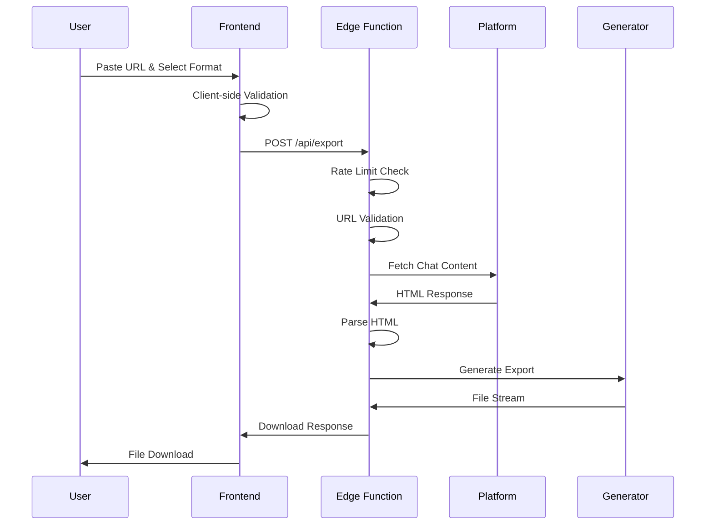

# Technical Architecture Document

## 1. System Overview

### 1.1 Architecture Philosophy

**Single-Page Application (SPA) + Edge Computing**
- Self-contained deployment unit (no separate backend)
- Edge-first processing for global performance
- Stateless design with privacy-by-design principles
- Progressive enhancement for reliability

**Key Principles:**
- **Simplicity**: Minimal moving parts, maximum reliability
- **Privacy**: No data persistence, client-side processing where possible
- **Performance**: Edge computing, optimized parsing, streaming responses
- **Scalability**: Serverless architecture, auto-scaling capabilities
- **Maintainability**: Clear separation of concerns, modular design

### 1.2 High-Level Architecture

```
┌─────────────────┐    ┌──────────────────┐    ┌─────────────────┐
│   User Browser  │───▶│  Vercel Edge     │───▶│ Export Pipeline │
│                 │    │  Function        │    │                 │
│ - React SPA     │◀───│                  │◀───│ - Parser        │
│ - Input/Output  │    │ - Rate Limiting  │    │ - Transformer   │
│ - File Download │    │ - Validation     │    │ - Generator     │
└─────────────────┘    │ - Orchestration  │    └─────────────────┘
                       └──────────────────┘            │
                                                      ▼
                       ┌──────────────────┐    ┌─────────────────┐
                       │  Chat Platforms  │    │ Format Engines  │
                       │                  │    │                 │
                       │ - ChatGPT        │    │ - PDF Generator │
                       │ - Claude         │    │ - MD Processor  │
                       │ - Gemini         │    │ - JSON Builder  │
                       │ - Perplexity     │    │ - CSV Builder   │
                       └──────────────────┘    └─────────────────┘
```

## 2. Technology Stack

### 2.1 Frontend Stack

**Core Framework:**
```typescript
React 18.2+ with TypeScript 5.0+
- Strict mode enabled
- Concurrent features for performance
- Error boundaries for resilience
```

**Styling & UI:**
```css
Tailwind CSS 3.3+ 
- Utility-first approach
- Custom design system
- Dark mode support
- Mobile-first responsive design

React Bits Components
- Pre-built, accessible components
- Consistent design language
- Animation and interaction patterns
```

**Build & Development:**
```javascript
Vite 4.0+
- Fast HMR development
- Optimized production builds
- ESBuild for TypeScript compilation
- Tree shaking and code splitting
```

### 2.2 Backend/Processing Stack

**Runtime Environment:**
```javascript
Node.js 18+ (Vercel Edge Runtime)
- ES modules support
- Web APIs compatibility
- Serverless function architecture
```

**Key Libraries:**
```typescript
// HTML Parsing
cheerio: "^1.0.0-rc.12"     // Server-side HTML manipulation
jsdom: "^22.1.0"            // DOM simulation for complex parsing

// PDF Generation  
puppeteer: "^21.0.0"        // Headless Chrome for PDF rendering
@vercel/og: "^0.5.0"        // Edge-optimized image/PDF generation

// Data Processing
markdown-it: "^13.0.1"     // Markdown generation and processing
csv-stringify: "^6.4.0"    // CSV generation
date-fns: "^2.30.0"        // Date handling and formatting

// HTTP & Networking
node-fetch: "^3.3.0"       // HTTP requests to chat platforms
cors: "^2.8.5"             // CORS handling
express-rate-limit: "^6.8.0" // Rate limiting
```

### 2.3 Development & Quality Tools

**Code Quality:**
```json
{
  "typescript": "^5.0.0",
  "eslint": "^8.45.0",
  "@typescript-eslint/parser": "^6.0.0",
  "prettier": "^3.0.0",
  "husky": "^8.0.3",
  "lint-staged": "^13.2.3"
}
```

**Testing Framework:**
```json
{
  "vitest": "^0.34.0",
  "@testing-library/react": "^13.4.0",
  "@testing-library/jest-dom": "^6.0.0",
  "playwright": "^1.36.0"
}
```

## 3. Component Architecture

### 3.1 Frontend Component Structure

```
src/
├── components/
│   ├── ui/              # React Bits components & custom UI
│   │   ├── Button/
│   │   ├── Input/
│   │   ├── Select/
│   │   └── LoadingSpinner/
│   ├── features/        # Feature-specific components
│   │   ├── URLInput/
│   │   ├── FormatSelector/
│   │   ├── ExportButton/
│   │   └── ErrorDisplay/
│   └── layout/          # Layout components
│       ├── Header/
│       ├── Footer/
│       └── Container/
├── hooks/               # Custom React hooks
│   ├── useExport/
│   ├── useValidation/
│   └── useDownload/
├── services/            # API and business logic
│   ├── exportService/
│   ├── validationService/
│   └── downloadService/
├── types/               # TypeScript type definitions
├── utils/               # Utility functions
└── constants/           # Application constants
```

### 3.2 Backend Processing Architecture

```
api/
├── export/              # Main export endpoint
│   └── [...params].ts   # Dynamic routing for platforms
├── validate/            # URL validation endpoint
│   └── index.ts
├── health/              # Health check endpoint
│   └── index.ts
└── lib/                 # Shared utilities
    ├── parsers/         # Platform-specific parsers
    │   ├── chatgpt.ts
    │   ├── claude.ts
    │   ├── gemini.ts
    │   └── perplexity.ts
    ├── generators/      # Format generators
    │   ├── pdf.ts
    │   ├── markdown.ts
    │   ├── json.ts
    │   ├── csv.ts
    │   └── text.ts
    ├── middleware/      # Request processing
    │   ├── rateLimit.ts
    │   ├── cors.ts
    │   └── validation.ts
    └── utils/           # Shared utilities
        ├── httpClient.ts
        ├── sanitizer.ts
        └── logger.ts
```

## 4. Data Flow & Processing Pipeline

### 4.1 Request Flow



### 4.2 Data Models

**Conversation Structure:**
```typescript
interface Conversation {
  id: string;
  title: string;
  platform: 'chatgpt' | 'claude' | 'gemini' | 'perplexity';
  createdAt: Date;
  updatedAt: Date;
  messages: Message[];
  metadata: ConversationMetadata;
}

interface Message {
  id: string;
  role: 'user' | 'assistant' | 'system';
  content: MessageContent;
  timestamp: Date;
  metadata?: MessageMetadata;
}

interface MessageContent {
  text: string;
  artifacts?: Artifact[];
  formatting?: FormattingInfo;
}

interface Artifact {
  type: 'code' | 'image' | 'file' | 'link';
  content: string;
  language?: string;
  filename?: string;
  metadata?: Record<string, any>;
}
```

**Export Configuration:**
```typescript
interface ExportConfig {
  format: 'pdf' | 'markdown' | 'json' | 'csv' | 'text';
  options: ExportOptions;
}

interface ExportOptions {
  includeMetadata?: boolean;
  includeTimestamps?: boolean;
  includeArtifacts?: boolean;
  customTemplate?: string;
  pageSize?: 'A4' | 'Letter';
  fontSize?: number;
}
```

### 4.3 Advanced Parser Architecture

**Multi-Strategy Parser System (See PARSING_STRATEGIES.md for full details):**
```typescript
class IntelligentParser {
  private strategies = [
    { name: 'fast-html', method: this.parseWithCheerio, timeout: 3000 },
    { name: 'api-discovery', method: this.parseWithAPI, timeout: 5000 },
    { name: 'browser-render', method: this.parseWithBrowser, timeout: 15000 },
    { name: 'ai-extraction', method: this.parseWithAI, timeout: 30000 },
    { name: 'community-rules', method: this.parseWithCommunityRules, timeout: 5000 },
  ];

  async parse(url: string): Promise<Conversation> {
    const platform = this.detectPlatform(url);
    const optimalStrategy = this.selectOptimalStrategy(platform);
    
    // Try optimal strategy first, then fallback chain
    for (const strategy of [optimalStrategy, ...this.strategies]) {
      try {
        const result = await this.executeWithTimeout(strategy, url);
        if (this.validateResult(result)) {
          this.recordSuccess(platform, strategy.name);
          return result;
        }
      } catch (error) {
        this.recordFailure(platform, strategy.name, error);
      }
    }
    
    throw new Error('All parsing strategies failed');
  }
}
```

**Platform Detection:**
```typescript
class PlatformDetector {
  static detect(url: string): Platform {
    const patterns = {
      chatgpt: /^https:\/\/chatgpt\.com\/share\/[a-f0-9-]+$/,
      claude: /^https:\/\/claude\.ai\/share\/[a-f0-9-]+$/,
      gemini: /^https:\/\/gemini\.google\.com\/share\/[a-f0-9]+$/,
      perplexity: /^https:\/\/www\.perplexity\.ai\/search\/.+$/
    };
    
    for (const [platform, pattern] of Object.entries(patterns)) {
      if (pattern.test(url)) {
        return platform as Platform;
      }
    }
    
    throw new Error('Unsupported platform');
  }
}
```

**Adaptive Strategy Selection:**
```typescript
class StrategyOptimizer {
  private analytics = new Map<string, StrategyMetrics>();
  
  selectOptimalStrategy(platform: string): ParsingStrategy {
    const metrics = this.analytics.get(platform);
    
    if (!metrics) {
      return this.getDefaultStrategy(platform);
    }
    
    // Select based on success rate, speed, and cost
    const scored = metrics.strategies.map(s => ({
      ...s,
      score: (s.successRate * 0.5) + (s.speed * 0.3) + (s.costEfficiency * 0.2)
    }));
    
    return scored.sort((a, b) => b.score - a.score)[0];
  }
}
```

**Community Rules Integration:**
```typescript
interface ParsingRule {
  id: string;
  platform: string;
  version: string;
  selectors: Record<string, string>;
  confidence: number;
  verified: boolean;
  lastUpdated: Date;
}

class CommunityRulesManager {
  private rules = new Map<string, ParsingRule[]>();
  
  async updateRules(): Promise<void> {
    const latestRules = await fetch('/api/parsing-rules').then(r => r.json());
    
    for (const rule of latestRules) {
      if (rule.verified && rule.confidence > 0.8) {
        this.addRule(rule);
      }
    }
  }
  
  getBestRule(platform: string): ParsingRule | null {
    const platformRules = this.rules.get(platform) || [];
    return platformRules
      .filter(r => r.verified)
      .sort((a, b) => b.confidence - a.confidence)[0] || null;
  }
}
```

## 5. Security Architecture

### 5.1 Security Layers

**Input Validation:**
```typescript
// URL Validation
const validateURL = (url: string): ValidationResult => {
  // 1. Format validation (regex)
  // 2. Domain whitelist check
  // 3. Protocol verification (HTTPS only)
  // 4. Length limits
  // 5. Malicious pattern detection
};

// Content Sanitization
const sanitizeHTML = (html: string): string => {
  // 1. Remove script tags
  // 2. Strip dangerous attributes
  // 3. Whitelist allowed HTML elements
  // 4. Encode special characters
};
```

**Rate Limiting:**
```typescript
// Vercel Edge Middleware
export const rateLimitConfig = {
  windowMs: 60 * 1000,        // 1 minute
  max: 10,                    // 10 requests per minute
  standardHeaders: true,
  legacyHeaders: false,
  keyGenerator: (req) => req.ip,
  handler: (req, res) => {
    res.status(429).json({
      error: 'Too many requests',
      retryAfter: 60
    });
  }
};
```

**CORS Configuration:**
```typescript
const corsConfig = {
  origin: process.env.NODE_ENV === 'production' 
    ? ['https://get-llm-chat.vercel.app'] 
    : ['http://localhost:3000'],
  methods: ['GET', 'POST'],
  allowedHeaders: ['Content-Type', 'Authorization'],
  credentials: false
};
```

### 5.2 Privacy & Data Protection

**Data Handling Policy:**
- **No Persistence**: No conversation data stored on servers
- **Temporary Processing**: Data exists only during request lifecycle
- **Memory Cleanup**: Explicit memory cleanup after processing
- **No Logging**: No conversation content in logs
- **HTTPS Only**: All communications encrypted

**Implementation:**
```typescript
class PrivacyManager {
  static async processConversation(url: string): Promise<ExportResult> {
    let conversation: Conversation | null = null;
    
    try {
      // 1. Fetch and parse
      conversation = await this.parseConversation(url);
      
      // 2. Generate export
      const result = await this.generateExport(conversation);
      
      // 3. Return stream (no storage)
      return result;
      
    } finally {
      // 4. Explicit cleanup
      if (conversation) {
        this.clearMemory(conversation);
      }
    }
  }
}
```

## 6. Performance Architecture

### 6.1 Frontend Performance

**Code Splitting:**
```typescript
// Lazy load export components
const ExportPage = lazy(() => import('./pages/ExportPage'));
const AboutPage = lazy(() => import('./pages/AboutPage'));

// Component-level splitting
const PDFGenerator = lazy(() => import('./components/PDFGenerator'));
```

**Caching Strategy:**
```typescript
// Service Worker for asset caching
const CACHE_NAME = 'llm-chat-exporter-v1';
const urlsToCache = [
  '/',
  '/static/js/bundle.js',
  '/static/css/main.css'
];

// React Query for request caching
const queryClient = new QueryClient({
  defaultOptions: {
    queries: {
      staleTime: 5 * 60 * 1000, // 5 minutes
      cacheTime: 10 * 60 * 1000, // 10 minutes
    },
  },
});
```

### 6.2 Backend Performance

**Edge Function Optimization:**
```typescript
// Optimized for Vercel Edge Runtime
export const config = {
  runtime: 'edge',
  regions: ['iad1', 'fra1', 'sin1'], // Multi-region deployment
};

// Streaming responses for large exports
export async function POST(request: Request) {
  const stream = new ReadableStream({
    start(controller) {
      // Stream PDF generation
    }
  });
  
  return new Response(stream, {
    headers: {
      'Content-Type': 'application/pdf',
      'Content-Disposition': 'attachment; filename="chat.pdf"'
    }
  });
}
```

**Parser Performance:**
```typescript
// Optimized HTML parsing
class OptimizedParser {
  private static readonly SELECTORS = {
    chatgpt: {
      messages: '[data-message-author-role]',
      content: '.markdown',
      timestamp: 'time'
    }
  };
  
  // Use efficient selectors, avoid DOM traversal
  parse(html: string): Conversation {
    const $ = cheerio.load(html, {
      decodeEntities: false, // Skip unnecessary decoding
      lowerCaseAttributeNames: false
    });
    
    // Batch DOM queries
    const messages = $(this.SELECTORS.chatgpt.messages);
    // Process in chunks to avoid memory spikes
  }
}
```

## 7. SEO & Analytics Architecture

### 7.1 SEO Optimization Strategy

**Technical SEO Implementation:**
```typescript
// next-seo configuration
import { NextSeo } from 'next-seo';

const SEO_CONFIG = {
  title: 'LLM Chat Exporter - Export AI Conversations to PDF, Markdown & More',
  description: 'Free tool to export ChatGPT, Claude, Gemini & Perplexity conversations to professional PDF, Markdown, JSON, CSV formats. Privacy-first, no storage.',
  canonical: 'https://get-llm-chat.vercel.app',
  openGraph: {
    type: 'website',
    locale: 'en_US',
    url: 'https://get-llm-chat.vercel.app',
    siteName: 'LLM Chat Exporter',
    images: [
      {
        url: 'https://get-llm-chat.vercel.app/og-image.png',
        width: 1200,
        height: 630,
        alt: 'LLM Chat Exporter - Export AI Conversations',
      },
    ],
  },
  twitter: {
    handle: '@vladbichev',
    site: '@get_llm_chat',
    cardType: 'summary_large_image',
  },
  additionalMetaTags: [
    {
      name: 'keywords',
      content: 'ChatGPT export, Claude export, AI conversation export, PDF export, Markdown export, Gemini export, Perplexity export',
    },
    {
      name: 'author',
      content: 'Vlad Bichev',
    },
  ],
};
```

**Structured Data Implementation:**
```typescript
// components/StructuredData.tsx
export const StructuredData: React.FC = () => {
  const structuredData = {
    '@context': 'https://schema.org',
    '@type': 'SoftwareApplication',
    name: 'LLM Chat Exporter',
    description: 'Export AI conversations from ChatGPT, Claude, Gemini, and Perplexity to multiple formats',
    applicationCategory: 'ProductivityApplication',
    operatingSystem: 'Web Browser',
    offers: {
      '@type': 'Offer',
      price: '0',
      priceCurrency: 'USD',
    },
    creator: {
      '@type': 'Person',
      name: 'Vlad Bichev',
      url: 'https://vladbichev.com',
    },
    featureList: [
      'Export ChatGPT conversations',
      'Export Claude conversations', 
      'Export Gemini conversations',
      'Export Perplexity conversations',
      'PDF format export',
      'Markdown format export',
      'JSON format export',
      'CSV format export',
      'Privacy-first approach',
    ],
  };

  return (
    <script
      type="application/ld+json"
      dangerouslySetInnerHTML={{ __html: JSON.stringify(structuredData) }}
    />
  );
};
```

**Content Strategy for SEO:**
```typescript
// pages/blog/index.tsx - Content marketing for SEO
const BLOG_TOPICS = [
  'how-to-export-chatgpt-conversations',
  'claude-conversation-export-guide',
  'ai-conversation-archiving-best-practices',
  'pdf-vs-markdown-export-comparison',
  'academic-research-ai-documentation',
  'enterprise-ai-conversation-management',
  'privacy-ai-conversation-export',
  'batch-export-ai-conversations',
];

// Dynamic sitemap generation
// pages/sitemap.xml.ts
export const getServerSideProps: GetServerSideProps = async ({ res }) => {
  const sitemap = generateSitemap([
    '/',
    '/about',
    '/privacy',
    '/terms',
    '/blog',
    ...BLOG_TOPICS.map(topic => `/blog/${topic}`),
  ]);
  
  res.setHeader('Content-Type', 'text/xml');
  res.write(sitemap);
  res.end();
  
  return { props: {} };
};
```

### 7.2 Analytics Architecture

**Google Analytics 4 Implementation:**
```typescript
// lib/analytics/gtag.ts
export const GA_TRACKING_ID = process.env.NEXT_PUBLIC_GA_ID;

export const pageview = (url: string): void => {
  if (typeof window !== 'undefined') {
    window.gtag('config', GA_TRACKING_ID, {
      page_path: url,
    });
  }
};

export const event = (action: string, parameters: any): void => {
  if (typeof window !== 'undefined') {
    window.gtag('event', action, parameters);
  }
};

// Custom events for tracking
export const trackExport = (platform: string, format: string): void => {
  event('export_conversation', {
    event_category: 'Export',
    event_label: `${platform}_${format}`,
    platform,
    format,
  });
};

export const trackError = (error: string, context: string): void => {
  event('export_error', {
    event_category: 'Error',
    event_label: error,
    context,
  });
};
```

**Anonymous User Tracking System:**
```typescript
// lib/analytics/userTracking.ts
import { v4 as uuidv4 } from 'uuid';

interface UserMetrics {
  anonymousId: string;
  sessionId: string;
  totalExports: number;
  platformUsage: Record<string, number>;
  formatPreferences: Record<string, number>;
  lastActive: Date;
  createdAt: Date;
}

class UserTracker {
  private anonymousId: string;
  private sessionId: string;

  constructor() {
    this.anonymousId = this.getOrCreateAnonymousId();
    this.sessionId = uuidv4();
  }

  private getOrCreateAnonymousId(): string {
    let id = localStorage.getItem('llm_exporter_uid');
    if (!id) {
      id = uuidv4();
      localStorage.setItem('llm_exporter_uid', id);
    }
    return id;
  }

  async trackExport(platform: string, format: string): Promise<void> {
    const metrics = {
      anonymousId: this.anonymousId,
      sessionId: this.sessionId,
      platform,
      format,
      timestamp: new Date().toISOString(),
      userAgent: navigator.userAgent,
      referrer: document.referrer,
    };

    // Send to analytics endpoint
    await fetch('/api/analytics/export', {
      method: 'POST',
      headers: { 'Content-Type': 'application/json' },
      body: JSON.stringify(metrics),
    });

    // Update local metrics
    this.updateLocalMetrics(platform, format);
  }

  private updateLocalMetrics(platform: string, format: string): void {
    const existing = JSON.parse(localStorage.getItem('llm_exporter_metrics') || '{}');
    const updated = {
      ...existing,
      totalExports: (existing.totalExports || 0) + 1,
      platformUsage: {
        ...existing.platformUsage,
        [platform]: (existing.platformUsage?.[platform] || 0) + 1,
      },
      formatPreferences: {
        ...existing.formatPreferences,
        [format]: (existing.formatPreferences?.[format] || 0) + 1,
      },
      lastActive: new Date().toISOString(),
    };
    localStorage.setItem('llm_exporter_metrics', JSON.stringify(updated));
  }
}

export const userTracker = new UserTracker();
```

**Analytics API Endpoints:**
```typescript
// api/analytics/export.ts
export default async function handler(req: NextRequest): Promise<NextResponse> {
  if (req.method !== 'POST') {
    return NextResponse.json({ error: 'Method not allowed' }, { status: 405 });
  }

  try {
    const {
      anonymousId,
      sessionId,
      platform,
      format,
      timestamp,
      userAgent,
      referrer,
    } = await req.json();

    // Store in analytics database (privacy-compliant)
    await storeAnalytics({
      anonymousId: hashUserId(anonymousId), // Hash for privacy
      sessionId,
      platform,
      format,
      timestamp,
      country: getCountryFromIP(req.ip),
      device: parseUserAgent(userAgent),
      referrer: sanitizeReferrer(referrer),
    });

    return NextResponse.json({ success: true });
  } catch (error) {
    return NextResponse.json({ error: 'Analytics failed' }, { status: 500 });
  }
}
```

## 8. Deployment Architecture Comparison

### 8.1 Vercel vs AWS EC2 Analysis

**Detailed Comparison Matrix:**

| Aspect | Vercel | AWS EC2 |
|--------|--------|---------|
| **Setup Complexity** | ⭐⭐⭐⭐⭐ Minimal | ⭐⭐ High complexity |
| **Deployment Speed** | ⭐⭐⭐⭐⭐ Instant | ⭐⭐⭐ Manual setup |
| **Scaling** | ⭐⭐⭐⭐⭐ Auto-scaling | ⭐⭐⭐ Manual/ASG |
| **Cost (Low Traffic)** | ⭐⭐⭐⭐⭐ Free tier | ⭐⭐ $5-20/month |
| **Cost (High Traffic)** | ⭐⭐⭐ $20-200/month | ⭐⭐⭐⭐ $50-500/month |
| **Performance** | ⭐⭐⭐⭐ Edge network | ⭐⭐⭐⭐ Configurable |
| **Maintenance** | ⭐⭐⭐⭐⭐ Zero maintenance | ⭐⭐ High maintenance |
| **Flexibility** | ⭐⭐⭐ Limited customization | ⭐⭐⭐⭐⭐ Full control |
| **Analytics Integration** | ⭐⭐⭐⭐ Built-in metrics | ⭐⭐⭐ Custom setup |
| **Security** | ⭐⭐⭐⭐ Managed security | ⭐⭐⭐ Self-managed |

**Vercel Advantages:**
```typescript
// Vercel Edge Functions - Automatic global distribution
export const config = {
  runtime: 'edge',
  regions: ['iad1', 'fra1', 'sin1', 'sfo1'], // Global edge locations
};

// Built-in analytics
export const analytics = {
  webVitals: true,        // Core Web Vitals tracking
  audiences: true,        // User segmentation
  performance: true,      // Request performance
  realtime: true,         // Real-time analytics
};

// Zero-config deployment
// git push → automatic deployment
// No server management required
```

**AWS EC2 Advantages:**
```typescript
// Full control over environment
const ec2Config = {
  instanceType: 't3.medium',
  storage: '20GB SSD',
  bandwidth: 'unlimited',
  customMiddleware: true,
  dockerSupport: true,
  loadBalancer: 'ALB',
  autoScaling: {
    min: 1,
    max: 10,
    targetCPU: 70
  }
};

// Custom analytics setup
const analyticsStack = {
  nginx: 'Access logs',
  cloudwatch: 'System metrics',
  elasticsearch: 'Log aggregation',
  grafana: 'Custom dashboards',
  prometheus: 'Application metrics'
};
```

### 8.2 Recommendation: Hybrid Approach

**Phase 1 (MVP): Vercel** ✅
```
Reasoning:
✅ Faster time to market
✅ Zero maintenance overhead
✅ Built-in CDN and edge compute
✅ Perfect for React/Next.js stack
✅ Cost-effective for initial traffic
✅ Built-in analytics and monitoring
```

**Phase 2 (Scale): Consider AWS** 
```
Migration Triggers:
- >10,000 exports per day
- Complex processing requirements
- Custom analytics needs
- Cost optimization at scale
- Enterprise compliance requirements
```

**Hybrid Architecture (Future):**
```typescript
// Multi-cloud deployment strategy
const deploymentStrategy = {
  frontend: 'Vercel', // Static assets + edge functions
  api: 'AWS Lambda', // Heavy processing workloads
  analytics: 'AWS RDS + CloudWatch', // Data persistence
  cdn: 'CloudFlare', // Additional caching layer
  monitoring: 'Sentry + DataDog', // Error tracking + APM
};
```

## 9. Deployment Architecture

### 9.1 Vercel Configuration

**vercel.json:**
```json
{
  "version": 2,
  "framework": "vite",
  "buildCommand": "npm run build",
  "outputDirectory": "dist",
  "functions": {
    "api/**/*.ts": {
      "runtime": "nodejs18.x",
      "maxDuration": 30
    }
  },
  "rewrites": [
    {
      "source": "/api/(.*)",
      "destination": "/api/$1"
    }
  ],
  "headers": [
    {
      "source": "/api/(.*)",
      "headers": [
        {
          "key": "Access-Control-Allow-Origin",
          "value": "*"
        },
        {
          "key": "Cache-Control",
          "value": "s-maxage=0"
        }
      ]
    }
  ]
}
```

### 7.2 Environment Configuration

**Environment Variables:**
```bash
# Production
NODE_ENV=production
VERCEL_URL=get-llm-chat.vercel.app

# Rate Limiting
RATE_LIMIT_MAX=10
RATE_LIMIT_WINDOW=60000

# Monitoring
SENTRY_DSN=https://...
ANALYTICS_ID=...

# Feature Flags
ENABLE_CLAUDE=true
ENABLE_GEMINI=true
ENABLE_PERPLEXITY=true
```

### 7.3 Monitoring & Observability

**Error Tracking:**
```typescript
import * as Sentry from '@sentry/node';

Sentry.init({
  dsn: process.env.SENTRY_DSN,
  environment: process.env.NODE_ENV,
  tracesSampleRate: 0.1,
});

// Custom error handling
export const handleError = (error: Error, context: string) => {
  Sentry.captureException(error, {
    tags: { context },
    extra: { timestamp: new Date().toISOString() }
  });
};
```

**Performance Monitoring:**
```typescript
// Custom metrics
export const trackExportMetrics = (platform: string, format: string, duration: number) => {
  // Track to analytics service
  analytics.track('export_completed', {
    platform,
    format,
    duration,
    timestamp: Date.now()
  });
};
```

## 8. Scalability Considerations

### 8.1 Horizontal Scaling

**Serverless Auto-scaling:**
- Vercel automatically scales edge functions
- No cold start issues with edge runtime
- Global distribution across regions

**Load Distribution:**
```typescript
// Geographic routing
export const config = {
  runtime: 'edge',
  regions: ['iad1', 'fra1', 'sin1', 'sfo1'], // US East, Europe, Asia, US West
};

// Platform-specific scaling
const getOptimalRegion = (platform: string) => {
  const regionMap = {
    chatgpt: 'iad1',    // Close to OpenAI servers
    claude: 'iad1',     // Close to Anthropic servers
    gemini: 'iad1',     // Close to Google servers
    perplexity: 'sfo1'  // Close to Perplexity servers
  };
  return regionMap[platform] || 'iad1';
};
```

### 8.2 Performance Optimization

**Caching Strategy:**
```typescript
// Edge caching for static content
export const revalidate = 86400; // 24 hours

// Dynamic caching for validated URLs
const urlCache = new Map<string, ValidationResult>();
const CACHE_TTL = 5 * 60 * 1000; // 5 minutes

export const getCachedValidation = (url: string) => {
  const cached = urlCache.get(url);
  if (cached && Date.now() - cached.timestamp < CACHE_TTL) {
    return cached.result;
  }
  return null;
};
```

**Resource Optimization:**
```typescript
// Streaming for large conversations
export const streamExport = async (conversation: Conversation, format: string) => {
  const encoder = new TextEncoder();
  
  return new ReadableStream({
    start(controller) {
      // Stream header
      controller.enqueue(encoder.encode(getHeader(format)));
      
      // Stream messages in chunks
      for (const message of conversation.messages) {
        const chunk = formatMessage(message, format);
        controller.enqueue(encoder.encode(chunk));
      }
      
      // Stream footer
      controller.enqueue(encoder.encode(getFooter(format)));
      controller.close();
    }
  });
};
```

## 9. Testing Architecture

### 9.1 Testing Strategy

**Unit Testing:**
```typescript
// Parser testing
describe('ChatGPTParser', () => {
  it('should extract conversation correctly', async () => {
    const html = await readFixture('chatgpt-example.html');
    const conversation = await parser.parse(html);
    
    expect(conversation.messages).toHaveLength(10);
    expect(conversation.title).toBe('Test Conversation');
  });
});

// Component testing
describe('ExportButton', () => {
  it('should handle export process', async () => {
    render(<ExportButton url="test-url" format="pdf" />);
    fireEvent.click(screen.getByRole('button'));
    
    await waitFor(() => {
      expect(screen.getByText('Downloading...')).toBeInTheDocument();
    });
  });
});
```

**Integration Testing:**
```typescript
// API endpoint testing
describe('/api/export', () => {
  it('should export ChatGPT conversation as PDF', async () => {
    const response = await fetch('/api/export', {
      method: 'POST',
      body: JSON.stringify({
        url: 'https://chatgpt.com/share/test-id',
        format: 'pdf'
      })
    });
    
    expect(response.status).toBe(200);
    expect(response.headers.get('content-type')).toBe('application/pdf');
  });
});
```

### 9.2 End-to-End Testing

**Playwright Configuration:**
```typescript
// e2e/export.spec.ts
test('complete export flow', async ({ page }) => {
  await page.goto('/');
  
  // Input URL
  await page.fill('[data-testid="url-input"]', 'https://chatgpt.com/share/test');
  
  // Select format
  await page.selectOption('[data-testid="format-select"]', 'pdf');
  
  // Trigger export
  await page.click('[data-testid="export-button"]');
  
  // Wait for download
  const downloadPromise = page.waitForEvent('download');
  const download = await downloadPromise;
  
  expect(download.suggestedFilename()).toContain('.pdf');
});
```

## 10. Future Architecture Considerations

### 10.1 Microservices Evolution

**Potential Service Separation:**
```
┌─────────────────┐    ┌─────────────────┐    ┌─────────────────┐
│   Frontend SPA  │    │  Parsing Service │    │ Export Service  │
│                 │    │                 │    │                 │
│ - React App     │───▶│ - URL Validation│───▶│ - PDF Generator │
│ - User Interface│    │ - HTML Parsing  │    │ - Multi-format  │
│ - Download UI   │    │ - Data Transform│    │ - Streaming     │
└─────────────────┘    └─────────────────┘    └─────────────────┘
```

### 10.2 Advanced Features Architecture

**Real-time Processing:**
```typescript
// WebSocket for live progress updates
export const setupWebSocket = () => {
  const ws = new WebSocket('/api/ws');
  
  ws.onmessage = (event) => {
    const progress = JSON.parse(event.data);
    updateProgressBar(progress.percentage);
  };
};
```

**Batch Processing:**
```typescript
// Queue-based batch exports
interface BatchJob {
  id: string;
  urls: string[];
  format: string;
  status: 'pending' | 'processing' | 'completed' | 'failed';
}

export const processBatch = async (job: BatchJob) => {
  const results = await Promise.allSettled(
    job.urls.map(url => exportConversation(url, job.format))
  );
  
  return createZipArchive(results);
};
```

This architecture provides a solid foundation for the LLM Chat Exporter, balancing simplicity with scalability, performance with maintainability, and features with reliability. 